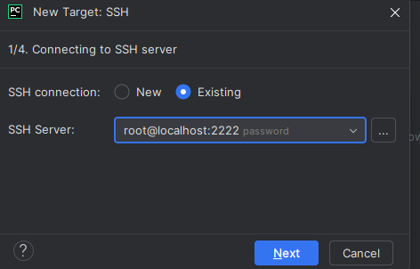
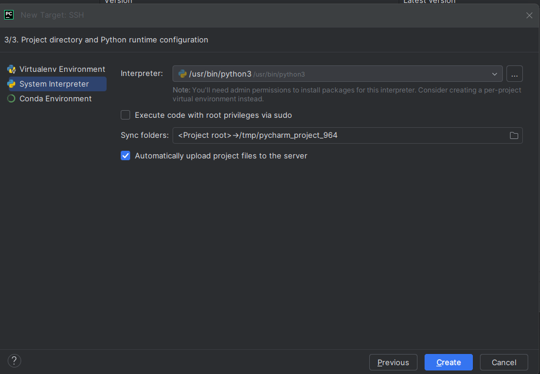

# CAS-Applied-Data-Science - Docker

How to work with Tensorflow GPU on Windows 11
For Step 1-4 you can also watch https://www.youtube.com/watch?v=xJtmj6hX5Lg or read 

## 1. setup wsl
wsl --install [windows-->ubuntu)

## 2. install docker on wsl
curl -fsSL https://get.docker.com -o get-docker.sh
docker --version
sudo groupadd docker
sudo usermod -aG docker $USER
close shell and open ubuntu(wsl) again
docker run hello-world

## 3. install nvidia toolkit
Also see https://docs.nvidia.com/datacenter/cloud-native/container-toolkit/latest/install-guide.html#installing-the-nvidia-container-toolkit

curl -fsSL https://nvidia.github.io/libnvidia-container/gpgkey | sudo gpg --dearmor -o /usr/share/keyrings/nvidia-container-toolkit-keyring.gpg \
  && curl -s -L https://nvidia.github.io/libnvidia-container/stable/deb/nvidia-container-toolkit.list | \
    sed 's#deb https://#deb [signed-by=/usr/share/keyrings/nvidia-container-toolkit-keyring.gpg] https://#g' | \
    sudo tee /etc/apt/sources.list.d/nvidia-container-toolkit.list

sudo apt-get update
sudo apt-get install -y nvidia-container-toolkit
sudo nvidia-ctk runtime configure --runtime=docker
sudo systemctl restart docker

## 4. Check that docker has GPU Access
docker run --rm --runtime=nvidia --gpus all ubuntu nvidia-smi
docker run --gpus all -it tensorflow/tensorflow:latest-gpu bash --> That launches shell inside Container
/# python
>>>import os
>>>os.environ['TF_CPP_MIN_LOG_LEVEL']='2'
>>>import tensorflow as tf
>>>tf.__version__
>>>print(tf.config.list_physical_devices('GPU'))
>>>exit()
/# exit

## 5 Create Dockerfile 
## When you want to use Ultralytics ypu need to
## RUN pip install ultralytics
## RUN pip install opencv-python-headless

FROM tensorflow/tensorflow:latest-gpu
RUN pip install matplotlib
RUN pip install matplotlib
RUN pip install scikit-learn
RUN echo 'Hallo aus dem Image'

RUN apt-get update && apt-get install -y openssh-server

RUN mkdir /var/run/sshd

RUN echo "root:password" | chpasswd

RUN echo 'PermitRootLogin yes' >> /etc/ssh/sshd_config

CMD ["/usr/sbin/sshd", "-D"]

## 6 Create Docker Image

cd /mnt/c/dev/git/CAS_Applied_Data_Science/docker --> Nav to folder where dockerfile is located
docker build . -t mytfimage

## 7 Run Docker Container
docker run --gpus all -v/mnt:/mnt -p 2222:22 mytfimage

## 8 Connect via SSH to COntainer
ssh root@localhost -p 2222

## 9 connect your IDE via SSH to Docker and use it as python interpreter

# what to do after restart whole system
open ubuntu
docker ps --> check if container are running
docker run --gpus all -v/mnt:/mnt -p 2222:22 --shm-size=2gb mytfimage ---> to use 2gig memory
docker run --gpus all -v/mnt:/mnt -p 2222:22 mytfimage

--> 9 connect your IDE via SSH to Docker and use it as python interpreter

# Some usefull commands

## Comand for Windows Power shell to manage Distributions
list all distributions:
wsl --list --all

delete distributeion 
wsl --unregister <dist-name>

## Docker
cd /mnt/c/dev/git/CAS_Applied_Data_Science/docker
docker build . -t mytfimage
docker run --gpus all -v/mnt:/mnt -p 2222:22 mytfimage
ssh root@localhost -p 2222
docker ps -q | xargs docker stop --> Stops all container
docker stop <container_id> --> stops single docker
docker rm <container_id> --> hard delete of contaienr
docker rm $(docker ps -a -q) --> delete all docker containers
docker rm $(docker kill $(docker ps -aq)) --> Kills all container and removes them
docker ps
docker ps -a
docker images
docker rmi image_name:tag --> deletes Image
docker container prune -f --> deletes all stopped containers
docker exec -it <container_id> bash --> enters the conteiner
docker inspect <container_id> | grep -i shm --> shows allocated memory

##Conda (But dont use Conda that doesnt work at all)
Activate the Environment <OCR_ENV>
conda activate OCR_ENV_P3117
conda deactivate
conda env list
conda remove --name ENVIRONMENT --all